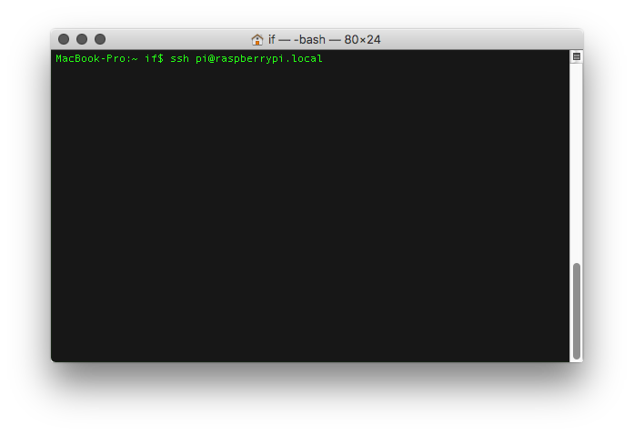
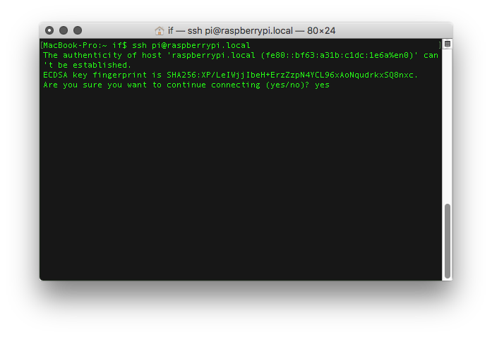
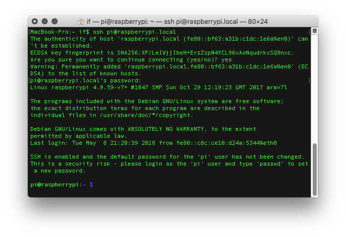

# PRYNTH DOCUMENTATION
* [Assembling the PCBs](#assembling-the-pcbs)
* [Uploading the Teensy Firmware](#uploading-the-teensy-firmware)
* [Installing the Raspberry Pi Image](#installing-the-raspberry-pi-image)
* [Audio](#audio)
* [Starting Prynth for the First Time](#starting-prynth-for-the-first-time)
* [Prynth Software](#prynth-software)
* [Sensors](#sensors)
* [GUI](#gui)
* [System Settings](#system-settings)
* [Linux Tips](#linux-tips)
* [Known Issues](#known-issues)

# Assembling the PCBs

This guide contains instructions on how to assemble the Prynth printed-circuit boards. They allow for the direct connection of sensors, like knobs, sliders and buttons, that can be used to create the instrument's physical interface.

The first step is to download the printed-circuit boards designs, distributed as [Eagle and Gerber files](../downloads/). These files can be sent to an online PCB service for manufacturing. Each manufacturer has a particular set of specifications and rules for the design of PCBs. The Prynth boards have been designed conforming to the [Dirty PCBs](http://dirtypcbs.com/) rules, with a 6 mil minimum tracing, which is common to many of these services.

## Requirements

<table style="width:100%; vertical-align: top">
<tr>
	<td valign="bottom">
		Soldering tools
		<br>
		<a href="images/soldering_tools.jpg"></a>
	</td>
	<td valign="bottom">
		Female jumper wire
		<br>
		<a href="images/female_jumper_wire.jpg"></a>
	</td>
	<td valign="bottom">
		Prynth Control PCB
		<br>
		<a href="images/prynth_control_top.jpg"></a>
	</td>
</tr>

<tr>
	<td valign="bottom">
		Muxi PCBs
		<br>
		<a href="images/muxi_top.jpg"></a>
	</td>
	<td valign="bottom">
		Teensy 3.1 or 3.2
		<br>
		<a href="images/teensy_top.jpg"></a>
	</td>
	<td valign="bottom">
		4051 multiplexer
		<br>
		<a href="images/4051_top.jpg"></a>
	</td>
</tr>

<tr>
	<td valign="bottom">
		Pin headers
		<br>
		<a href="images/headers_top.jpg"></a>
	</td>
	<td valign="bottom">
		2 x 20 GPIO header
		<br>
	<a href="images/header20_top.jpg"></a>
	</td>
	<td valign="bottom">
		<br>
	</td>
</tr>
</table>


## Prynth Control PCB
The main circuit board in Prynth is the Control PCB. It uses an embedded Teensy 3.2 micro-controller that does sensor signal acquisition and sends the data to the Raspberry Pi via GPIO connection.


1. **Teensy Micro-controller**
The first step in the assembly of the Prynth Control PCB is to mount the Teensy micro-controller on the board. This can be done through three different techniques. Some are more difficult than others, but also provide more features (namely access to I2C). We will describe all of them, ranked from easier to more difficult, and let the user decide which applies best.

	<br>

	1.1 **Soldering the Teensy using female and male headers**
		Pros: Easy to solder; Teensy can be easily removed.
		Cons: No access to the I2C block;
		<br>
		1.1.1 Solder the male pins to the Teensy.
		[](images/control_assembly_1_1.jpg)
		<br>
		1.1.2 Solder the female pins to the Muxi Control.
		[](images/control_assembly_1_2.jpg)
		<br>
		1.1.3 Connect the Teensy to Muxi Control.
		[](images/control_assembly_1_3.jpg)

	<br>

	1.2 **Soldering the Teensy using only male headers**
		Pros: Easy to solder. Lower height profile.
		Cons: No access to the I2C block; Teensy will be not be removable.
		<br>
		1.2.1 Solder the male pins to the Teensy.
		[](images/control_assembly_1_1.jpg)
		<br>
		1.2.2 Place the Teensy on Muxi Control and solder the headers.
		[](images/control_assembly_2_2.jpg)
		<br>
		1.2.3 Clip extra leads.

	<br>

	1.3 **Soldering the Teensy directly on the PCB**
		Pros: Access to the I2C block and accompanying digital pins. On the Control PCB, this group of pins are located above the Teensy.
		<a href="images/control_I2C_block.png"></a>
		Cons: Difficult to solder (for intermediate/advanced users); Teensy will be not be removable.
		<br>
		1.3.1 Set two rows of male pins on a breadboard.
		[](images/control_assembly_3_1.jpg)
		<br>
		1.3.2 Set the Teensy on the pins, turned upside down.
		[](images/control_assembly_3_2.jpg)
		<br>
		1.3.3 Add a very thin layer of solder on the horizontal pads. Make sure it creates a very thin film. Excess solder could create bumps that can be problematic when seating the Teensy directly on the PCB. Any excess solder can be removed using solder wick. An alternative to the solder film is the application of solder paste or flux.
		[](images/control_assembly_3_3.jpg)
		<br>
		1.3.4 Set the Control board upside down on the Teensy's pins. Make sure the two boards are aligned, by peeking through the soldering holes. You should be able to see the pads slightly shifted outwards. Make sure the board is secure. If necessary, solder one of the other Teensy pins, but keep in mind you will desolder it afterwards.
		[](images/control_assembly_3_4.jpg)
		[](images/control_assembly_3_5.jpg)
		<br>
		1.3.5 Flow solder through each of the pins on the central column. The solder will create an air bubble that will eventually escape, creating a solder connection to the underneath pads.
		[](images/control_assembly_3_6.jpg)
		<br>
		1.3.6 Remove the Control PCB from the breadboard pins. Put some solder wire through each of the remaining pins and apply heat to both sides, creating a soldering bridge.
		[](images/control_assembly_3_7.jpg)
		[](images/control_assembly_3_8.jpg)
		<br>
		1.3.7 Test connections with a multimeter. If necessary, flow more solder until the connection is established.
		<br>
		<a id="Note">Note:</a>
		This technique requires some soldering experience. It might be difficult to remove the Teensy after an eventual soldering error. To desolder the Teensy after this procedure, the best bet is the use of a heater plate or a hot air gun.
		Keep in mind that this procedure is only necessary if you want to use I2C digital sensors.

<br>

2.  **Prynth Control GPIO header**
This female header establishes the connection between the Raspberry Pi and the Control board.

	<br>

	2.1 Insert the 2 x 20 GPIO female header from the bottom of the board, so that the holes of the female header are facing down and the pins facing up.
	[](images/control_assembly_gpio_header.jpg)
	<br>
	2.2 Solder the header from the top of the board.
	<br>
	<a id="Note">Note:</a>
	If you don't have a 2x20 female header, you can alternatively use two rows of regular female headers. The advantage of the 2x20 female header is that the extra long pins will allow you to continue to extend the Raspberry Pi GPIO pins.

<br>

3. **Connectors**
	Install male pins according to the required connections (analog, I2C, SPI or digital).
	<br>
	3.1 Install male pins facing upwards.
	[](images/control_assembly_pins.jpg)
	<br>
	3.2 Solder from the bottom of the board.

<br>

4. **Result**
	Final result (minus MIDI output). My god, it's full of pins!
	[](images/control_assembly_full.jpg)

<br>

5. **Assembly**
	Carefully attach the Control Board to the Raspberry Pi.
	[](images/control_rpi.jpg)


## Muxi Daughterboards

The 10 analog inputs of Prynth Control can be expanded by connecting up to 10 Muxi daughterboards, offering a total of up to 80 input channels for analog sensors. The Muxi daughterboards are optional. If the intended application uses 10 or less analog sensors, they can be connected directly to Prynth Control. The Muxi daughterboards also includes an optional pull-down resistor for each input, which is convenient for connecting switches and variable resistors.
<br>
1. **4051 8-channel analog multiplexer**
	1.1 Take the Muxi PCB and the 8-channel multiplexer.
	[](images/muxi_assembly_1_1.jpg)
	[](images/muxi_assembly_1_2.jpg)
	<br>
	1.2 Position the multiplexer making sure that it is in the right orientation, which can be verified by the small indentation on the chip.
	[](images/muxi_assembly_1_3.jpg)
	<br>
	1.3 Solder the multiplexer from the bottom of the board.

<br>

2. **Connector to Prynth Control**
	2.1 Install a 6 pin header row right in the slot above the 4051.
	[](images/muxi_assembly_1_4.jpg)
	<br>
	2.2 Solder the pins.

<br>

3. **Sensor connectors**
	3.1 Populate the sensor connectors with rows of three male pins.
	<br>
	[](images/muxi_assembly_1_5.jpg)
	3.2 Solder the pins.

<br>

4. **Pulldown resistors**
	Switches and some types of variable resistors need pulldown resistors to form a circuit. On the right of the Muxi boards there is a column to install pulldown resistors, in the same order as the sensors. Assuming the use of 10K variable resistors, a 1K pulldown resistor should be appropriate.

	<br>

	4.1 Insert the two leads of the resistor.
	[](images/muxi_assembly_1_6.jpg)
	<br>
	4.2 Solder from the bottom and clip leads.

<br>

5. **Result**
	Final result (minus pulldown resistors).
	[](images/muxi_assembly_full.jpg)

<br>

6. **Assembly**
	Using a 6 pin female header cable, connect the Muxi Daughterboard to Prynth Control. Pay attention to the orientation of the cable. While facing the two boards, the pins have a direct correspondence.
	[](images/muxicontrol_muxi_connection.jpg)

---

# Uploading the Teensy Firmware
This guide will describe how to upload the Prynth program for the Teensy.
To proceed make sure to complete the steps described on the Muxi Control board assembly.

## Requirements

<table style="width:100%; vertical-align: top">
<tr>
	<td valign="top">
		PC or MAC with a USB connection
		<br>
		
	</td>
	<td valign="top">
		Micro-B USB to USB cable
		<br>
		
	</td>
	<td valign="top">
		Teensy firmware program
		<br>
		<br>
		<a href="https://prynth.github.io/create/downloads.html">[Download]</a>
	</td>
</tr>
</table>

1. Download and install the [Arduino IDE](https://www.arduino.cc/en/Main/Software).
[](images/arduino_download_page.png)
<br>
2. Open the Arduino IDE and close it again (so it is initialized before step 3).
<br>
3. Download and install the [Teensyduino software](https://www.pjrc.com/teensy/td_download.html) for your operating system. Instructions are included on the Teensy's download page.
[](images/teensyduino_download_page.png)
<br>
4. Connect the Teensy's micro USB port to the USB on the computer.
[](images/control_usb_connection.jpg)
<br>
5. Download the [Prynth's Teensy source code](https://prynth.github.io/create/downloads.html) and store it in a known location on the computer's hard drive.
<br>
6. Launch the Arduino IDE software and open the "Prynth.ino" file from the Teensy project folder.
[](images/teensy_sw_1.png)
<br>
7. Choose Teensy 3.1 / 3.2 as the target board on the Arduino IDE menu.
[](images/teensy_sw_2.png)
<br>
8. Choose the programming serial port on the Arduino IDE menu.
[](images/teensy_sw_3.png)
<br>
9. Verify that the program is correct and contains no errors by clicking the "verify" button on the Arduino IDE.
[](images/teensy_sw_4.png)
<br>
10. Finally, upload the program by clicking the upload button on the Arduino IDE. This should launch an additional Teensy window that will report success or failure and automatically reboot the Teensy once the program is uploaded.
[](images/teensy_sw_5.png)

---

# Installing the Raspberry Pi Image
This guide contains instructions on how to setup Prynth's Raspberry Pi image. This image is based on the official Raspbian distribution, but with the addition of all Prynth services (including SuperCollider and the Prynth server) and a few other tweaks.

The process is the same as installing the official Raspberry Pi image. Several methods and softwares can be used and many derivatives can be found on the Internet. To keep the process as simple as possible, we've based these guides on the software officially recommended in the Raspberry Pi documentation.

# Requirements:

<table style="width:100%; vertical-align: top">
<tr>
	<td valign="top">
		PC or MAC with a SD Card slot
		<br>
		
	</td>
	<td valign="top">
		Prynth Raspberry Pi Image file
		<br>
		<a href="">[Download]</a>
	</td>
	<td valign="top">
		Micro SD Card (recommended size of at least 8 Gb)
		<br>
		
	</td>
</tr>

<tr>
	<td valign="top">
		SD Card adapter
		<br>
		
	</td>

</tr>
</table>

The easiest way to burn the Prynth image to the microSD card is to use a GUI application. The official recommendation from the RPi Foundation is Etcher, which is free, very simple to use and runs on multiple platforms (Windows, Mac and Linux).

1. Download and install [Etcher](https://etcher.io/).
<br>
2. Download and unzip the [Prynth Raspberry Pi image from the downloads section](https://prynth.github.io/create/downloads.html).
<br>
3. Insert the microSD Card into the computer.
<br>
4. Run Etcher.
[](images/etcher.png)
<br>
5. Click "Select Image" and navigate to the Prynth img file.
[](images/etcher_1.png)
[](images/etcher_2.png)
<br>
6. Make sure the microSD card is selected.
[](images/etcher_3.png)
<br>
7. Click "flash" and wait for the process to complete.
[](images/etcher_4.png)
<br>
8. When the process is over, eject the microSD Card, remove it and insert it into the Raspberry Pi. The microSD slot is located on the underside of the board.
[](images/insert_micro_sd_card.jpg)
<br>
<a id="Note">Note:</a>
. Class 10 MicroSD Cards are recommended. They considerably boost the Raspberry Pi's performance with faster read/write speeds.
. The Prynth image is as close as possible to the original Raspbian distribution, in order to take advantage of the many RPi manuals and how-to's found on the Internet.

---
# Audio
Prynth can use any audio device that works in ALSA. This includes the USB-compliant audio cards, Raspberry Pi I2S cards and the Pi's analog output.

## USB
The USB card should be class-compliant to work in Linux.
We've tested some USB audio dongles with the C-Media chips, cheaply found in the market. All of them worked, but with different audio qualities and gain. We've also tested the Behringer UCG102 with good results.

<a id="Note">Note:</a>
There is a known problem with the Raspberry Pi's USB controller that can cause audio artifacts with USB cards that work at USB full-speed, as defined in the USB 1.x implementation. For these types of audio cards to work correctly the "Force USB 1.1" option should be set on Prynth's settings panel (more information on the Settings section). The disadvantage of this choice is that USB 2.0 devices can show erratic behavior.

## I2S
I2S audio cards connect directly to the Raspberry Pi's GPIO. We've tested Prynth with the [Audio Injector](http://www.audioinjector.net/) and the [Fe-Pi](https://fe-pi.com/) Products with good results.

## Pi Analog Output
The Pi's analog audio output does not use a codec. It is created through PWM modulation that is then lowpass filtered. Therefore it is not recommended for applications that require good audio quality and low latencies.


# Starting Prynth for the First Time

1. Make sure the RPi is connected to your local network via Ethernet cable.
<br>
2. Power the Raspberry Pi and wait a few seconds. A good indication of a complete boot is that the green led of the RPi will stop blinking so often.
<br>
3. By default, Prynth includes a chime (that you can later change) to give you some sonic feedback of when the boot process is complete.
<br>
2. Open a web browser and go the following url:
[http://raspberrypi.local:3000](http://raspberrypi.local:3000)
<br>
3. The web browser should load Prynth's frontend web application.
[](images/prynth_frontend.png)
Note: As of Prynth version 0.53, the first boot will happen twice to automatically expand the filesystem. Two consecutive chimes should be heard.

---

# Prynth Software
This guide contains instructions on how to get started with the Prynth software. With it you'll be able to not only create new SuperCollider programs, but also manage files and manipulate many of the system's settings.

To create a new program for your Prynth instrument you will need a computer, tablet or smartphone with a web browser. As long as they are both on the same network Prynth's software should be accessible by visiting the following address:

[http://raspberrypi.local:3000](http://raspberrypi.local:3000)

Prynth's frontend web application:

[](images/prynth_frontend.png)

## Code Editor
In the code editor you'll be able to write new SuperCollider programs, defining the sound of the instrument and how to interact with it.

Here is a simple SuperCollider "hello world" program:
```
"hello world!".postln;
```
[](images/editor_hello_world.png)

To execute this program you can either click the "Run" button or, like in SuperCollider, use Cmd+Enter (Mac) or Ctrl+Enter (Windows, Linux) to run the current line or selection.

Now for a simple oscillator:
```
{SinOsc.ar(440, 0, 0.2)}.play;
```
[](images/editor_simple_sine.png)

To stop the sound press the button "Kill" or use the SuperCollider shortcuts: Cmd+. (Mac) or Ctrl+. (Windows, Linux).

The "Help" button launches the SuperCollider documentation on a new browser tab.

Bellow these buttons is the "Post Window", where SuperCollider messages are received, including errors or print messages. The Post window can be cleared using the "Clear" button and resized vertically using the handle on the lower right corner.

It is out of the scope of this manual to fully introduce the SuperCollider programming language. For more information on SuperCollider consider the following resources:
. [SuperCollider Tutorials](https://supercollider.github.io/tutorials/)
. [SuperCollider Online Documentation](http://doc.sccode.org/)
. [SuperCollider Mailing List](http://new-supercollider-mailing-lists-forums-use-these.2681727.n2.nabble.com/)
. [SuperCollider book](http://supercolliderbook.net/)

---

# Sensors
Many different types of sensors can be used to create a physical interface for the instrument. In this guide we show some examples of sensor connections, their configuration and how to use them in SuperCollider.

## Connecting Sensors

### Potentiometer
A potentiometer or any other voltage divider can be connected to the first three pins of either the Muxi board or the Control board.
<a href="images/pot_example.png"></a>

### Push buttons and Variable Resistors
A push button or a variable resistor will require a pull-down resistor. The Muxi board can be populated directly with pull-down resistors, The Control board will require external circuitry to include the resistor.

<a href="images/button_example.png"></a>

### I2C Devices
I2C devices are connected directly to the I2C block on the Control board. Note that the pin ordering for I2C devices might change, depending on the manufacturer.

<a href="images/i2c_example.png"></a>

Every I2C device is implemented differently, so using this type of sensors with Prynth requires dedicated Arduino programming. This includes device library setup, data pooling functions and the injection of raw data into Prynth's sensor data buffer. The Teensy folder on Prynth's distribution includes an example for the LSM9DS0 accelerometer, which should be easy to adapt to other I2C devices.


### SPI Devices
At the time of writing, SPI devices remain untested, but the procedure should be similar to that of I2C devices.

## Sensor Settings
After the connection of sensors they need to be parametrized on the Sensor Settings page. To launch it, click on the button labeled "Sensors" on Prynth's main window.
[](images/sensor_settings_1.png)

This will open a new tab with the Sensor Settings page.
[](images/sensor_settings_2.png)

The first parameter is **"Sample Rate"**  (expressed in Hz). This option dictates the speed of acquisition **per sensor** and is the same for all 127 possible sensors. The default value is 50 Hz. Depending on the type of sensor used, high acquisition rates might be necessary, so it is possible to drive the system at up to 200 Hz. Keep in mind that higher acquisition rates might be more taxing to the system.
[](images/sensor_settings_3.png)

Each row corresponds to a Muxi board and its 8 sensors. To **select a sensor**, click the grid or select it from the dropdown menu.
[](images/sensor_settings_4.png)

To **turn the sensor on**, click the "on/off" checkbox. The corresponding sensor should be highlighted on the grid.
[](images/sensor_settings_5.png)

To **monitor the values** of the currently selected sensor turn on monitoring.
[](images/sensor_settings_6.png)
All sensor data is normalized (values expressed between 0 and 1).

In the **"OSC Address"**, the user can set the address of the OSC message sent to SuperCollider. This address always starts with the hostname of the Raspberry Pi (in this case "raspberrypi"), followed by the string specified by the user. Naming should follow the typical OSC convention, with strings separated by forward slashes:

<a id="Example">Ex:</a>
/raspberrypi/my_sensor

By default, the sensor are addressed as, with indexes starting in 0:
/hostname/multiplexer/sensor

<a id="Example">Ex:</a>
/raspberrypi/1/2 refers to the second multiplexer and the third sensor.

All analog sensor signals are acquired with 12-bit resolution but they can be sent to SuperCollider using different resolutions. Setting **"Resolution"** to "Low" will use one byte (255 possible values), while setting it to "High" will use 4 bytes (65535 values). Like the sampling rate, the resolution of sensors may impact performance, so it is best to reserve high resolutions for cases where they're truly needed. Common potentiometers, buttons and variable resistors should be usable with low resolutions, while other sensors such as IMUs might take advantage of higher resolution ranges.

In the **Filter** section, the user can choose a filter to be applied to the data, commonly used to avoid noise issues. These filters are computed directly on the Teensy per sensor. There is a choice of 3 different types of filters:

1) Lowpass Filter - a traditional lowpass filter.
2) One Euro Filter - an adaptive low pass filter, which may render better results for fast changing signals. For more information on One Euro Filter please consult:  [http://cristal.univ-lille.fr/~casiez/1euro/](http://cristal.univ-lille.fr/~casiez/1euro/). One Euro filter was created by Géry Casiez, Nicolas Roussel, and Daniel Vogel.
3) Schmidt Trigger - useful for binary sensors, like for example switches.

The "Transmit" button will save and transmit the current configuration to the Teensy. The "Recall" button can be used to get the current configuration and "Reset" to wipe clean any configuration in order to start over.

At startup, the system will automatically load the last saved configuration.

<a id="Note">Note:</a>
The abuse of high sample rates, high resolutions or more complex filtering might lead to an eventual overload of the Teensy processor. If this happens, an error message will be displayed in the sensor monitor field. The Teensy will then need to be restarted, which can be done by removing the PCB Control board from the Raspberry Pi's GPIO or by powering down the system. The 200 Hz sample rate limit was chosen based on our stress tests, but the inclusion of untested digital sensors might be considerably taxing for the Teensy's processor.  

## Accessing Sensor Values in SuperCollider
Sensor values can be sent to the SuperCollider language or directly to the SuperCollider Server.
To switch between these two modes open the System settings from Prynth's main window and change the sensor data target.
[](images/system_settings_button.png)

[](images/system_settings_data_target.png)

Changing this option will prompt you to reboot Prynth.

### SuperCollider Language
The sensor values can be received in SuperCollider language with the help of OSCDef, which will trigger a callback function any time it receives a new value on the specified address.

~~~
OSCdef(\test, {|msg, time, addr, recvPort|
	msg[1].postln; //print the sensor value
}, '/raspberrypi/0/0', n);
~~~

Values are stored on the "msg" variable, in the form of an Array. The first element, msg[0], is the address (raspberrypi/0/0) and the second, msg[1], is the sensor value.

<a id="Example">Ex:</a>
Mapping of the sensor value to the frequency of an oscillator. Normalized values are rescaled linearly, to fall in a range from 100 to 500 Hz.
~~~
fork{
	SynthDef(\test, { |freq = 220|
		var sig;
		sig = SinOsc.ar(freq, mul: 0.1);
		Out.ar([0,1], sig);
	}).add;

	s.sync;

	~testsynth = Synth(\test);

	s.sync;

	OSCdef(\test, {|msg, time, addr, recvPort|
		~testsynth.set(\freq, msg[1].linlin(0, 1, 100, 500));
	}, '/raspberrypi/0/0', n);
};
~~~

### SuperCollider Server
When the "Sensor Data Target" is set to "Server", the sensor values will be sent directly to the SuperCollider server. They can be accessed as signals, directly on the DSP chain, using the In.kr object.

<a id="Example">Ex:</a>
Mapping of the sensor 0 of multiplexer 0 to the oscillator frequency
~~~
fork{
	SynthDef(\test, {
		var sig;
		sig = SinOsc.ar(In.kr(100).range(100, 500), mul: 0.1);
		Out.ar([0,1], sig);
	}).add;

	s.sync;

	Synth(\test);
};
~~~

In this case, there is no explicit OSC addresses for the messages. Instead the user must derive the channel number using the following rule:

**Sensor addresses are composed by concatenating the multiplexer number with the sensor number (both starting at 0) and offsetting that number by 100.**

Address = (multiplexer number & sensor number) + 100

The address number 134 would correspond to the fourth multiplexer and the fifth sensor:
134 = (3 & 4) + 100

---

#GUI
Prynth includes a GUI editor for the creation of custom virtual controls.
The GUI editor is launched using the corresponding button on Prynth's main page or by visiting the url [http://raspberrypi.local:3000/gui](http://raspberrypi.local:3000/gui).

[](images/gui_button.png)

The GUI editor should look like:
[](images/gui_1.png)

In the above example we see the different types of objects that can be used to build GUIs (slider,  knob, number, switch, button and label). Objects can be freely added and distributed on the canvas. To move an object, use the little square on the upper left corner.

The square can also used to select an object, which will become highlighted for easier visual recognition. The shortcut "Ctrl+Space" can also be used to cycle between objects.

When an object is selected, its properties will be displayed on the Properties panel to the right. These include a name, the control value, positioning coordinates, dimensions and color. All properties can be edited directly on the panel, updating the object in realtime. The Properties control panel can also be dragged and relocated closer to the objects of interest.

New objects are created using the corresponding buttons on the "Add Objects" panel or using the following keyboard shortcuts:

Ctrl + 1 - slider
Ctrl + 2 - knob
Ctrl + 3 - number
Ctrl + 4 - switch
Ctrl + 5 - button
Ctrl + 6 - label

When an object is created using buttons, it will appear on the upper left corner of the canvas and will need to be dragged to its intended position. Objects created via shortcut will be placed at the current position of the mouse pointer.

The currently selected object can be deleted using the "Delete Selected" button or using the "delete" key. The "Clear All" button will delete all objects in the canvas.

The Options panel includes a "Grid" option that increases the step of dragging.

GUIs can be saved, loaded and deleted using the "GUI Files" panel. The last saved GUI will be automatically opened when the GUI editor is first accessed.

Finally, the "Edit/Play" switch is used to toggle between the two states. Play mode will lock the interface and hide the control panels.

Each object will send an exclusive OSC message with an address composed from the object's name. For example, the object named "slider0" will send an OSC message on the following address:

~~~
/raspberrypi/gui/slider0
~~~

Make sure to check the included GUI example.

---

# System Settings
The "System" settings panel contains several options to configure the system. It can be accessed from Prynth's main page, which will open a new browser tab.

[](images/system_settings_button.png)

[](images/system_settings_1.png)

## Wi-Fi
Set your SSID and Password to connect to a Wi-Fi network. Clicking the "connect" button will attempt the connection and the newly attributed IP address should become visible on Prynth's System Panel.
[](images/system_settings_2.png)

## Hostname
Changing the hostname will allow you to have a custom name for your instrument. This is more convenient and safer than using the default hostname. After this change, the Prynth system is accessed using a new url:
http://mynewhostname.local:3000

The Sensor OSC namespace will also change to:
/mynewhostname/multiplexer/sensor

## Default SuperCollider File
This is the SuperCollider program that will run automatically when the system is booted. The default is set to a file named "default.scd", but it can be changed to any other file.

Here is the default.scd file that ships with the Prynth distribution:
~~~
s.waitForBoot{
	~path = "/home/pi/prynth/server/public/supercolliderfiles/";
	(~path++"chime.scd").load;
};
~~~

The "s.waitForBoot" method assures the booting of the SuperCollider Server and plays the startup chime. Any other SuperCollider files can be added and executed using the "load" method.

## Sensor Data Target
Allows for the choice of sending sensor data to the SuperCollider language or the SuperCollider server. For more details refer to the section "Accessing sensor values in SuperCollider" of this manual.

## Audio Device
### Device ID
Specifies the number of the ALSA device to be used. Usually 0 is the onboard Raspberry Pi sound output and any external audio card will have the number 1.

### Vector Size
Specifies the vector size to be used by Jack. Lower vector sizes have lower latencies but audio processing can be overloaded quicker. It is possible to lower the vector size as much as 64 samples, which is still usable if the DSP activity is low, like in a simple subtractive synthesis patch. More complex patches may require 128 samples and up to avoid audio artifacts, like pops or clicks.

## Sample Rate
Determines the sample rate used by Jack. Currently this option only allows for a choice of 44100 or 48000 sample rates.

## Number of Periods
Refers to the number of periods used by Jack. Typically a value of 3 for USB soundcards but I2S soundcards can use a value of 2. A lower number of periods will result in lower latencies.

## Force USB 1.1
Checking this option will force the Raspberry Pi's USB controller to use a maximum speed according to the USB 1.x specification. This option might be necessary if using USB 1.x speed devices. For more information check the "Audio" section of this manual.

---

# Linux Tips
Here we offer some tips on Linux operations that may be useful in Prynth.
## SSH Session
A Secure Shell Session (SSH) can be used to access the Raspberry Pi using a command-line interface.

1. To open an SSH session, open your Terminal program and write:
~~~
ssh pi@raspberrypi.local
~~~
<br>

2. Some systems might display a message asking for the acceptance of a key fingerprint. Answer "yes".

<br>
3. Next the Raspberry Pi will ask for a password for user "pi". The default password is the same as in the original Raspbian distribution, which is "raspberry". A successful login will show a prompt with "pi@raspberrypi".


## ALSA Mixer
Prynth's audio device uses a digital audio path that starts with SuperCollider, that connects to Jack, which in turn uses the ALSA audio infrastructure.
The ALSA mixer command line application can be used to better adjust the levels of your audio output.

1. Log to the Raspberry Pi via SSH.
<br>
2. Launch the ALSA mixer application by typing "alsamixer".

<br>
3. The Alsamixer can be controlled using the keyboard. When first launched the settings shown are relative to the first ALSA device, in our case the Raspberry Pi's analog output. To change the parameters for an external audio card first Press F6.

Now use the arrow keys to select your audio card and Enter to confirm your selection.

<br>
4. Navigate between inputs and outputs using the right and left arrow keys. Adjust the volume using the up and down keys.

<br>
5. To finish press Escape. Your settings will be saved and restored after a reboot.

## Expanding the MicroSD Card Partition
After the installation of the Prynth Linux image on the SD Card, the filesystem must be expanded to make available all of the space in the memory card.

1. Connect to the Raspberry Pi via SSH session.
<br>
2. Launch the Raspberry Pi configuration program, by typing "sudo raspi-config":

<br>
3. Raspi-config will run. Using the cursor arrow keys on you keyboard select option 7 "Advanced Options".

<br>
4. Next select option A1 "Expand Filesystem"

<br>
5. Once the process is complete, the system will launch a confirmation dialog. Press Enter for "OK"

<br>
6. Back in the raspi-config main screen, use Tab key to navigate to the option "Finish" and press Enter.

<br>
7. Raspi-config will offer to reboot the system to finish the process. Choose "Yes".


---
# Known Issues
## Running Large Programs via Shortcut Keys
When running very large SuperCollider programs (more than 5000 characters), selecting all the code and using the shortcut keys Cmd+Enter or Ctrl+Enter may fail to run the program. Large programs should be executed using the "Run" button, which uses a temporary file that is automatically saved and executed.

## Hostname Failure
Based on your local network configuration, the hostname of the Raspberry Pi might not be accessible. In this case it is possible to use the device's IP address to access Prynth's frontend.

<a id="Example">Ex:</a>
http://192.168.1.1:3000/

OSC messaging will still work using the original hostname.
